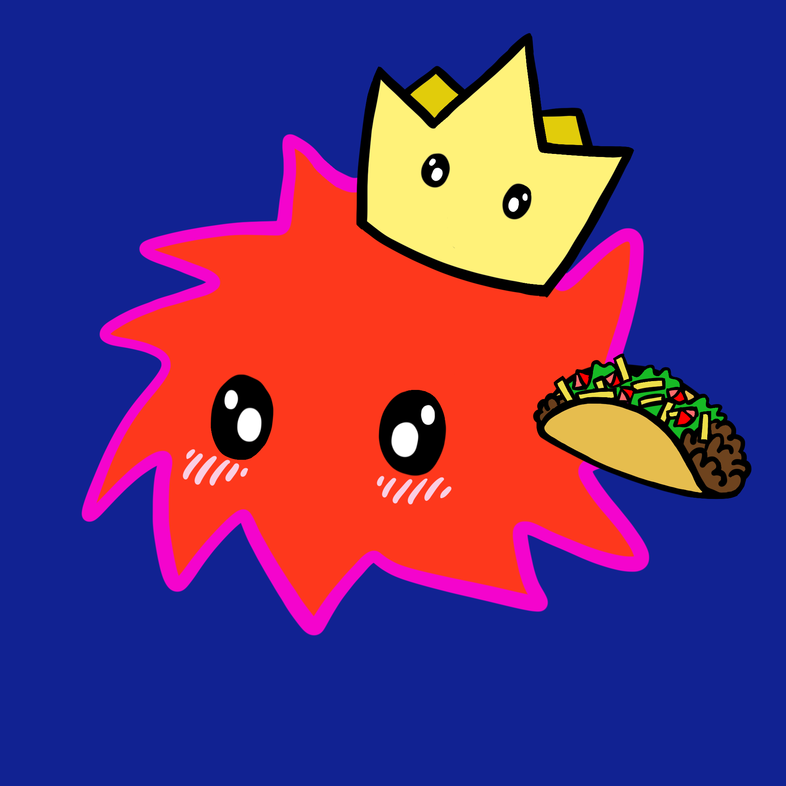

# Fuzzbois

Fuzzy little characters built from a six-digit hash code. Every code picks a body style, a body color, up to three accessories and sometimes a rarity, and the same six digits become the background color. By Astra.



## What's in here

| Folder | What it is |
|---|---|
| `site/` | **Fuzzboi Forge** — type a code, get that exact Fuzzboi at 2048×2048 and save it as a PNG. `site/layers/` holds the 32 cut-out layers it stacks. |
| `art/procreate-export/` | The original Procreate "PNG Files" export (`Fuzzbois-1.png` … `Fuzzbois-33.png`), navy background baked in. 33 is the design notes page. |
| `art/banner/` | The Fuzzbois parade banner and the nine sprites cut from it. |
| `3d/` | The 3D Fuzzboi #456800 (red, crown, taco, blush): Blender source, FBX, Unity package, previews, and the script that builds it. |
| `tools/key_layers.py` | Removes the baked-in navy background from a Procreate export and names each layer by its trait. |
| `legacy/2021/` | `Ownable.sol` from the 2021 NFT attempt (an OpenZeppelin contract, previously committed under the file name "SPDX License Identifier: MIT"). |

## Run the generator

Browsers won't export a canvas built from `file://` images, so serve the folder:

```sh
cd site
python3 -m http.server 8000
# open http://localhost:8000/#456900
```

The page loads every layer in `site/layers/` automatically. A code in the address (`#456900`) opens that Fuzzboi.

## The code

Positions are read left to right. Digits 0–9 only for now.

| Position | Trait | Rule |
|---|---|---|
| 1 | Body style | 0–2 → **A** (fuzzy black outline) · 3–5 → **B** (pink spiky outline) · 6–9 → **C** (cloud) |
| 2 | Body color | 1/6 → 1 · 2/7 → 2 · 3/8 → 3 · 4/9 → 4 · 5/0 → 5 |
| 3 | Accessory 1 | see list |
| 4 | Accessory 2 | see list |
| 5 | Accessory 3 | see list · no Fuzzboi wears two hats |
| 6 | Rare flag | 0 = rare |
| all six | Background | the code itself, as a hex color |

**Accessories** (numbered as in the Procreate layers): 0 nothing · 1 cowboy hat · 2 joint · 3 birthday hat · 4 butterfly · 5 flower · 6 crown · 7 glasses · 8 cheese · 9 taco. Hats are 1, 3 and 6.

**Rarities:** 1 hands · 2 feet · 3 eyelashes · 4 blush.

Layer order, bottom to top: feet, body fill, body outline, glasses, eyes, blush, eyelashes, hands, taco, cheese, crown, flower, birthday hat, joint, cowboy hat, butterfly.

### Still undecided

- **Letters A–F.** Hex codes can contain them, but no trait uses them yet, so the generator rejects them.
- **How a rarity is picked.** The generator currently gives every rarity whose number (1–4) appears in positions 1–5 when position 6 is 0. That can't produce some drawn Fuzzbois (a pink cloud with hands), so the real rule is probably different.
- **Taco vs. cheese numbering.** The design notes say taco 8, cheese 9; the Procreate layers say cheese 8, taco 9. The generator follows the layers.

## Exporting layers from Procreate

1. Open the Layers panel and **uncheck "Background color"** so the layers come out transparent.
2. Actions (wrench) → Share → Share Layers → **PNG Files**.
3. Files arrive as `Fuzzbois-1.png` … numbered from the bottom of the stack; the generator maps those numbers to traits. If the background was left on, run `python3 tools/key_layers.py` from a folder containing `x/fuzzbois/` to cut it out.

## 3D

`3d/build_fuzzboi.py` builds the model with Blender's Python module (`pip install bpy`) and checks that the crown and taco don't intersect the body, nudging them out if they do. `python3 3d/build_fuzzboi.py render` also renders previews. Import `Fuzzboi_456800.unitypackage` into Unity via Assets → Import Package → Custom Package. The pink rim is an inverted hull, so it needs a back-face-culled shader (Unity Standard works; Poiyomi or lilToon look better in VRChat). It's about 170k triangles: fine as a world prop, too heavy for an avatar.
